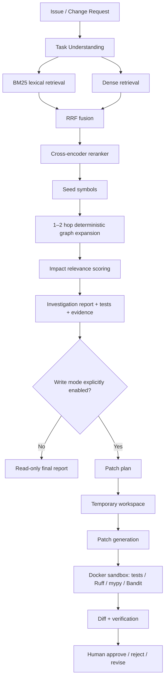

# RepoAtlas — Graph-Enhanced Repository Intelligence & Safe Coding Agent

RepoAtlas is a production-oriented, local-first software-engineering AI system that maps an issue or change request to the most relevant files, symbols, dependencies, and tests, then optionally proposes and verifies a patch in an isolated workspace.

> **Default cost posture:** $0 mandatory external LLM/API subscription cost. Local hardware/electricity are not free. Commercial model adapters are optional and disabled.

## Why this is not “send a repo to an LLM”

RepoAtlas combines syntax-aware code parsing, symbol chunks, lexical retrieval, dense embeddings, reciprocal-rank fusion, reranking, deterministic dependency graphs, multi-hop evidence expansion, typed tools, a bounded investigation workflow, Git cutoff controls, sandboxed verification, and human approval.

## Core architecture



## V0 → V6 experimental progression

| Version | Architecture | Purpose |
|---|---|---|
| V0 | lexical/BM25 | strong exact-identifier baseline |
| V1 | dense symbol RAG | semantic localization |
| V2 | hybrid + RRF | lexical + semantic complementarity |
| V3 | hybrid + reranker | candidate precision |
| V4 | V3 + graph expansion | dependency-aware localization |
| V5 | bounded investigation agent | iterative evidence acquisition |
| V6 | agent + isolated patch verification | safe coding workflow |

Metrics are intentionally **TBD until local execution**. `scripts/run_full_evaluation.py` generates JSON, CSV, and Markdown reports.

## Current open-source stack (2026 verification snapshot)

- Python 3.12 target.
- Primary model benchmark: `Qwen/Qwen3-Coder-30B-A3B-Instruct-FP8` via vLLM OpenAI-compatible endpoint. This is a 30.5B MoE model (3.3B activated) and is Apache-2.0. On a 32 GB RTX 5090 it may be memory-tight once KV cache is included, so test conservatively.
- First-run/faster fallback: `Qwen/Qwen3-8B` (Apache-2.0), which is much more comfortable on 32 GB VRAM.
- Embeddings: `BAAI/bge-m3` (MIT), 1024 dimensions, up to 8192 tokens.
- Reranker: `BAAI/bge-reranker-v2-m3` (Apache-2.0).
- Tree-sitter + `tree-sitter-python` for syntax-aware parsing, with Python `ast` used only as a deterministic enrichment/fallback layer.
- Qdrant for vector persistence; NetworkX for the first dependency-graph implementation.
- LangGraph for bounded state orchestration; direct Python service layer remains usable without it.
- MCP Python SDK v2 adapter (optional, same underlying tool layer).
- FastAPI + Gradio.
- PostgreSQL optional; SQLite default for self-contained runs.
- OpenTelemetry + self-hosted Phoenix optional.
- Docker sandbox for execution; network disabled by default.

## Default demo repository

The configuration uses `encode/httpx` as the initial public Python target. It is BSD licensed, has a substantial test suite, synchronous and asynchronous APIs, transports/auth/cookies/timeouts, and meaningful cross-module relationships while remaining manageable for a single-repository benchmark.

## Safety boundaries

1. Read-only mode is default (`ENABLE_WRITE_TOOLS=false`).
2. Original repositories are never edited by patch tools.
3. Historical benchmark agents see only `base_commit` and earlier history.
4. Retrieved repository text is untrusted data and cannot override tool policy.
5. No unrestricted host shell is exposed to the LLM.
6. Execute tools use an isolated Docker container with no network by default, non-root user, limits, timeout, and restricted mount.
7. Level-4 actions (push, PR, merge, deploy) are not implemented in the MVP.

## Quick start

See **`RUNBOOK.md`** for the exact Windows 11 → WSL2 → RTX 5090 → Docker execution order.

Minimal CPU smoke path:

```bash
python -m venv .venv
source .venv/bin/activate
pip install -e '.[dev]'
python -m scripts.create_fixture_repo
python -m scripts.parse_repository --repo data/fixture_repo
python -m scripts.build_index --repo data/fixture_repo --embedding hash
python -m scripts.build_graph --repo data/fixture_repo
pytest -q
```

Local API/UI after indexing:

```bash
uvicorn repoatlas.api.main:app --reload --port 8080
python app/gradio_app.py
```

## Project layout

- `src/repoatlas/` — core library
- `scripts/` — reproducible orchestration and debugging commands
- `benchmark/` — benchmark builders/runners and gold schema
- `configs/` — model, retrieval, graph, agent, sandbox, evaluation, app settings
- `sandbox/` — restricted execution image
- `tests/` — unit, integration, security, smoke tests
- `reports/` — generated metrics/failure-analysis outputs (TBD until runs)
- `docs/` — architecture, research verification, model/hardware notes
- `deployment/huggingface/` — safe read-only demo packaging notes

## Evidence format

Reports cite repository evidence as, for example:

- `[SRC: src/auth/token.py:L120-L164]`
- `[SYM: TokenManager.refresh]`
- `[TEST: tests/test_auth.py::test_refresh_expired]`
- `[EDGE: refresh_token -> CacheManager.get]`
- `[GIT: <commit-at-or-before-cutoff>]`

RepoAtlas exposes an activity timeline (tools, files, symbols, tests, outcomes), not hidden chain-of-thought.

## Evaluation

Primary retrieval measures:

- affected-file Recall@5 / Recall@10
- affected-symbol Recall@5 / Recall@10
- Precision@K, MRR, nDCG

Also generated: graph-added recall, irrelevant expansion rate, changed-file/symbol precision/recall, impacted-test recall, agent step/tool metrics, patch/test/static-analysis outcomes, latency/context/VRAM fields, and V0→V6 ablations.

## Limitations before your first local run

The repository is delivered with complete code paths, but no fabricated benchmark claims. GPU inference, actual Qdrant/Phoenix/Postgres containers, external repo installation, and Docker sandbox execution must be validated on the target Windows 11/WSL2/RTX 5090 system. See `VALIDATION.md` for what was verified in the build environment.

## Deployment posture

The full source/evidence belongs on GitHub. Public interactive deployment should remain read-only with curated precomputed repository data. Hugging Face compute availability/pricing can change; the included Gradio deployment is optional and must not become a mandatory paid dependency. Vercel should host the portfolio/case-study frontend, not the 30B model or sandbox.

## License

RepoAtlas code is MIT licensed. Third-party repositories/models retain their own licenses; see `DATA_SOURCES.md` and `docs/RESEARCH_VERIFICATION.md`.
