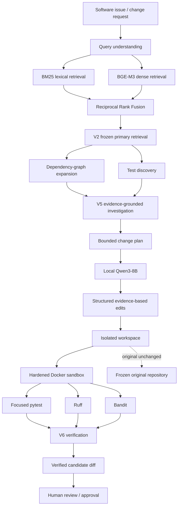

# RepoAtlas — Graph-Enhanced Repository Intelligence & Safe Coding Agent

[](https://www.python.org/)
[](https://huggingface.co/Qwen)
[](https://huggingface.co/BAAI/bge-m3)
[](#agentic-investigation)
[](#dependency-graph)
[](https://fastapi.tiangolo.com/)
[](https://www.gradio.app/)
[](https://www.docker.com/)
[](https://github.com/unit-mole/repoatlas-agentic-rag/actions)
[](LICENSE)

A portfolio-grade **Agentic AI / Code RAG system for software engineering** that maps software issues to affected files and symbols, combines lexical and semantic retrieval with repository graphs, discovers related tests, performs bounded evidence-grounded investigation, and verifies candidate code changes inside an isolated sandbox.

**Status:** Portfolio-ready local build · Frozen historical TEST evaluation complete · V6 safe-patch workflow verified  
**Repository:** [unit-mole/repoatlas-agentic-rag](https://github.com/unit-mole/repoatlas-agentic-rag)  
**Primary stack:** Python · Qwen3-8B · BGE-M3 · BM25 · Reciprocal Rank Fusion · dependency graphs · FastAPI · Gradio · Docker · pytest · Ruff · Bandit

> **Default mandatory paid external LLM/API dependency: $0.**  
> The validated reasoning path uses a locally served open-source Qwen3 model. Hardware, electricity, and internet access are not claimed to be free.

---

## Responsible Use

RepoAtlas is a software-engineering research and portfolio system, not an autonomous production code-deployment service.

- Generated investigations and patches must be reviewed before acceptance.
- Gold historical fixes are evaluator-only and are never exposed to the runtime agent.
- Write tools are explicitly gated and disabled by default.
- Candidate edits are applied only inside an isolated workspace.
- The original target repository is preserved unchanged.
- Test execution occurs inside a hardened Docker sandbox.
- RepoAtlas does not autonomously push, merge, or deploy code.

---

## Business Problem

Software engineers frequently need to modify repositories they did not originally build.

A request that sounds small—

> “Version configuration should raise a clear error when required version arguments are missing.”

—may require understanding:

- the relevant module and class,
- exact implementation symbols,
- indirectly related code,
- repository dependency relationships,
- regression-test locations,
- historical behavior,
- safe change boundaries,
- and whether a proposed change actually passes verification.

Traditional keyword search is strong for exact identifiers. Dense RAG is strong for semantic similarity. Neither alone reliably captures program structure and change impact.

RepoAtlas addresses:

> **What is affected, why is it affected, what should change, and can the change be verified safely?**

---

## Project Objective

Build an end-to-end repository-intelligence system that can:

1. Parse real Python repositories and retain exact provenance.
2. Extract symbols and syntax-aware chunks.
3. Compare lexical, dense, hybrid, reranked, and graph-enhanced retrieval.
4. Freeze retrieval decisions before touching the final TEST benchmark.
5. Build repository dependency relationships.
6. Discover tests associated with likely code changes.
7. Run bounded evidence-grounded agentic investigations.
8. Use a local Qwen3 model without mandatory paid LLM APIs.
9. Generate a minimal change plan only when sufficient evidence exists.
10. Apply candidate edits only inside an isolated workspace.
11. Run focused tests and quality/security checks in Docker.
12. Verify the final diff and preserve the original repository.
13. Export reproducible evaluation evidence and failure analysis.
14. Expose the project through FastAPI and Gradio.
15. Package the project as a recruiter-readable engineering case study.

---

## Project Pattern

| Item | Implementation |
|---|---|
| Project name | `repoatlas-agentic-rag` |
| Application | Repository intelligence, change-impact analysis, and safe code modification |
| Reasoning model | Qwen3-8B locally |
| Dense embeddings | `BAAI/bge-m3` |
| Sparse retrieval | BM25 |
| Fusion | Reciprocal Rank Fusion |
| Frozen primary retrieval | V2 Hybrid |
| Reranker | BGE selective reranker retained as an ablation |
| Repository structure | Symbol / dependency graph |
| Agent | Evidence-grounded bounded investigation |
| Safe coding | Structured edits in isolated workspaces |
| Test execution | Hardened Docker sandbox |
| Quality gates | pytest · Ruff · Bandit |
| API / UI | FastAPI · Gradio |
| Evaluation | Frozen historical HTTPX issue-to-fix benchmark |
| Cost posture | $0 mandatory paid external LLM/API dependency |

---

## Tools and Technologies

| Area | Technology |
|---|---|
| Language | Python 3.12 |
| Local reasoning | Qwen3-8B |
| Dense retrieval | BAAI/bge-m3 |
| Sparse retrieval | BM25 |
| Fusion | Reciprocal Rank Fusion |
| Reranker ablation | BGE cross-encoder |
| Repository graph | Python static/syntax relationships |
| Agent orchestration | Bounded deterministic investigation workflow |
| Safe edits | Structured evidence-line-range edits |
| Sandbox | Docker |
| Tests | pytest |
| Code quality | Ruff |
| Security analysis | Bandit |
| API | FastAPI |
| UI | Gradio |
| Automation | GitHub Actions |
| Packaging | Git tags + reproducible ZIP/checksum |
| License | MIT |

---

## What This Repository Demonstrates

- Syntax-aware repository ingestion
- Python symbol extraction
- Exact file/symbol provenance
- BM25 lexical code retrieval
- BGE-M3 dense code retrieval
- Dense + BM25 hybrid retrieval
- Reciprocal Rank Fusion
- Selective reranking as a measured ablation
- Dependency-graph construction and expansion
- Related-test discovery
- Frozen benchmark methodology with leakage prevention
- Evidence-grounded issue investigation
- Local Qwen3 reasoning
- Safe structured code-edit generation
- Fail-closed patch application
- Isolated workspaces
- Network-disabled Docker execution
- Focused pytest execution
- Ruff and Bandit verification
- Original-repository immutability
- FastAPI
- Gradio
- Reproducible JSON / CSV / Markdown experiment evidence
- GitHub CI

---

## Architecture



---

## Retrieval Architecture

RepoAtlas treats code retrieval as an experimental system rather than assuming that “more AI” is always better.

```text
Issue
 ├── BM25 lexical retrieval
 └── BGE-M3 dense retrieval
          ↓
 Reciprocal Rank Fusion
          ↓
 V2 Hybrid — frozen primary retrieval
          ↓
 Repository graph / test discovery
          ↓
 Evidence-grounded investigation
```

### Selected primary retrieval strategy

```text
V2 Hybrid = BM25 + BGE-M3 + Reciprocal Rank Fusion
```

The primary retrieval architecture was frozen before final TEST evaluation. Later TEST results were not used to redesign or tune the retrieval system.

---

## Dependency Graph

RepoAtlas builds deterministic repository relationships around symbols and files so the agent can reason beyond vector similarity.

The graph layer supports repository intelligence such as:

- imports,
- symbol relationships,
- dependency neighborhoods,
- related files,
- test associations,
- multi-hop evidence expansion.

The final protected graph experiment is reported honestly: graph expansion preserved the frozen V2 aggregate retrieval metrics on the five-case TEST set, but did **not** produce an aggregate retrieval gain.

The graph therefore remains valuable as a structural reasoning and impact-analysis layer without claiming an unsupported benchmark improvement.

---

## Experimental Evolution

| Version | Purpose | Outcome |
|---|---|---|
| V0 | Lexical/BM25 baseline | Exact-match baseline |
| V1 | Dense BGE-M3 retrieval | Semantic retrieval |
| V2 | BM25 + BGE-M3 + RRF | **Frozen primary retrieval** |
| V3 / V3S | Reranking / selective reranking | Small deep-rank symbol gain, materially higher latency |
| V4 / V4P | Graph-enhanced retrieval | Structural layer retained; no aggregate TEST gain |
| V5 | Evidence-grounded investigation agent | Validated investigation workflow |
| V6 | Safe patch generation + sandbox verification | **Verified safe-patch workflow** |

These versions are experimental stages inside one complete repository, not separate products.

---

## Verified Frozen-TEST Results

RepoAtlas was evaluated on **five frozen historical HTTPX issue-to-fix cases** using repository snapshots from the commit immediately before each historical fix.

The runtime sees only the pre-fix repository state. Historical FIX data is evaluator-only.

### V2 primary retrieval

| Metric | Frozen TEST |
|---|---:|
| File Recall@5 | **0.729** |
| File Recall@10 | **0.757** |
| File Recall@20 | **0.843** |
| Symbol Recall@5 | **0.350** |
| Symbol Recall@10 | **0.400** |
| Symbol Recall@20 | **0.400** |
| File MRR | **0.583** |
| File nDCG@10 | **0.593** |

### Protected graph ablation — V4P

| Metric | V2 | V4P |
|---|---:|---:|
| File Recall@5 | 0.729 | 0.729 |
| File Recall@10 | 0.757 | 0.757 |
| File Recall@20 | 0.843 | 0.843 |
| Symbol Recall@10 | 0.400 | 0.400 |
| MRR | 0.583 | 0.583 |
| nDCG@10 | 0.593 | 0.593 |

**Conclusion:** protected graph expansion preserved the baseline but did not improve aggregate retrieval on this TEST set.

### Selective reranker ablation — V3S

| Metric | V2 | V3S |
|---|---:|---:|
| File Recall@10 | **0.757** | **0.757** |
| Symbol Recall@5 | **0.350** | 0.272 |
| Symbol Recall@10 | 0.400 | **0.422** |
| Symbol Recall@20 | 0.400 | **0.422** |
| Mean retrieval / E2E latency | **30.9 ms** | **981.7 ms** |

V3S provided a small improvement at deeper symbol ranks but reduced Symbol Recall@5 and increased end-to-end latency by roughly an order of magnitude. V2 therefore remains the frozen primary retrieval architecture.

### Changed-test discovery

| Source | Recall@10 | Recall@20 | MRR |
|---|---:|---:|---:|
| V2 Hybrid | **0.667** | **0.933** | 0.360 |
| V3 Rerank | 0.467 | 0.700 | **0.450** |

V2 retained materially stronger changed-test recall.

---

## Agentic Investigation

V5 converts retrieval evidence into a bounded repository investigation.

For the validated HTTPX configuration task, the agent correctly localized:

- `httpx/_config.py`
- `Version.__init__`
- `tests/test_config.py`
- the relevant version-regression test area

The investigation layer is evidence-grounded: the LLM explains and synthesizes repository evidence, while tool selection limits, graph expansion, stopping conditions, and safety boundaries remain code-controlled.

---

## V6 Safe Coding Workflow

V6 extends investigation into controlled code modification:

```text
Issue
  ↓
Frozen V2 retrieval
  ↓
V5 evidence
  ↓
Deterministic patch plan
  ↓
Local Qwen3 patch generation
  ↓
Structured evidence-based edits
  ↓
Isolated workspace
  ↓
Hardened Docker sandbox
  ↓
Focused tests + Ruff + Bandit
  ↓
Diff verification
  ↓
Human review
```

### Verified V6 historical task

Task:

> Version configuration should raise a clear error when required version arguments are missing.

RepoAtlas generated a bounded two-file modification affecting exactly:

```text
httpx/_config.py
tests/test_config.py
```

Verified outcome:

| Check | Result |
|---|---|
| Structured edits applied | **2** |
| Historical changed-file overlap | **Exact** |
| Focused HTTPX tests | **33 passed** |
| Ruff verification | **PASS** |
| Bandit verification | **PASS** |
| Docker network | **Disabled** |
| Read-only sandbox root | **Enabled** |
| Linux capabilities | **Dropped** |
| Original frozen repository | **Unchanged** |
| Final V6 gate | **PASS** |

The validated guard was introduced in `Version.__init__`, together with a regression test for constructing `httpx.Version()` without required arguments.

---

## Security Model

Autonomous code modification is treated as a security problem rather than only a generation problem.

### Write boundary

Write-capable tools require an explicit environment gate:

```text
ENABLE_WRITE_TOOLS=true
```

Without it, RepoAtlas stays read-only.

### Workspace isolation

Candidate changes are applied to a copied workspace. The frozen source repository remains untouched.

### Hardened execution

The Docker sandbox is designed around:

```text
network = none
read-only root
dropped capabilities
no-new-privileges
bounded CPU / memory / process limits
```

### Fail-closed editing

Structured edits are rejected when evidence cannot be matched safely. RepoAtlas does not force uncertain patches into the workspace.

### Quality and security gates

Candidate modifications are checked with:

- focused pytest,
- Ruff,
- Bandit,
- diff verification,
- original-repository immutability checks.

---

## Benchmark Methodology and Leakage Prevention

Historical issue-to-fix evaluation follows:

```text
Historical issue / task
        ↓
BASE commit before the fix
        ↓
Frozen repository snapshot
        ↓
No future commits or patches visible to runtime
        ↓
RepoAtlas execution
        ↓
Historical FIX used only by evaluator
```

The frozen retrieval configuration is checksum-protected:

```text
configs/retrieval_frozen_v1.json
SHA256:
57e20457c7728d3886f6914f63d4f4aef711cd85b262e24606ca09199a2a14b6
```

This separation prevents benchmark fixes from leaking into retrieval, planning, or patch generation.

See:

- [`BENCHMARK.md`](BENCHMARK.md)
- [`reports/final/FINAL_RESULTS.md`](reports/final/FINAL_RESULTS.md)
- [`reports/final/final_results_manifest.json`](reports/final/final_results_manifest.json)

---

## Failure Analysis

Development failures are retained as engineering evidence instead of being hidden.

Important V6 failure modes included:

1. **Free-form unified diff corruption**  
   Replaced by structured evidence-based edits.

2. **Brittle exact-text replacement**  
   Improved through evidence-line-range editing and fail-closed matching.

3. **Historical test dependency mismatch**  
   The candidate patch was correct, but the sandbox initially lacked HTTPX test dependencies such as `trustme`. Historical dependencies were then explicitly provisioned and the same patch passed **33 focused tests**.

4. **Reranker latency trade-off**  
   Selective reranking improved deeper symbol recall slightly but materially increased latency and worsened early-rank symbol recall.

5. **Graph ablation neutrality**  
   Graph expansion did not improve aggregate frozen-TEST retrieval, so RepoAtlas does not claim that it did.

---

## Reproducibility Evidence

Final experiment evidence is exported as:

```text
reports/final/
├── FINAL_RESULTS.md
├── final_metrics_inventory.csv
└── final_results_manifest.json
```

The final manifest records SHA-256 hashes of the experiment artifacts used as evidence.

Major frozen TEST artifacts include:

```text
reports/experiments/httpx-test-test-discovery.json
reports/experiments/httpx-test-v3s-selective-reranker.json
reports/experiments/httpx-test-v4p-protected-graph.json
reports/experiments/v5-httpx-test-005.json
reports/experiments/v6-httpx-test-005.json
```

No result in the final evidence export is fabricated.

---

## Local Validation

Final local quality checks completed successfully:

```text
Ruff:                         PASS
RepoAtlas pytest suite:       35 passed
Frozen retrieval checksum:    PASS
FastAPI test:                 PASS
Python application compile:   PASS
Tracked secret scan:          PASS
Tracked large-file scan:      PASS
V6 focused HTTPX tests:       33 passed
V6 final safe-patch gate:     PASS
```

---

## Local Application Interfaces

### FastAPI

The API implementation lives under:

```text
src/repoatlas/api/
```

Run the appropriate application entry point documented in [`RUNBOOK.md`](RUNBOOK.md).

The repository includes API tests under:

```text
tests/test_api.py
```

### Gradio

The local UI entry point is:

```text
app/gradio_app.py
```

Run:

```bash
python app/gradio_app.py
```

The public deployment posture should remain read-only unless a properly hardened execution environment is available.

---

## Repository Structure

```text
repoatlas-agentic-rag/
├── .github/
│   └── workflows/
├── app/
│   └── gradio_app.py
├── benchmark/
│   ├── builders/
│   ├── cases/
│   ├── gold/
│   └── runners/
├── configs/
├── docs/
│   ├── ARCHITECTURE.md
│   ├── PORTFOLIO_NOTES.md
│   ├── RESEARCH_VERIFICATION.md
│   └── THREAT_MODEL.md
├── reports/
│   ├── experiments/
│   └── final/
├── sandbox/
├── scripts/
├── src/
│   └── repoatlas/
│       ├── agents/
│       ├── api/
│       ├── embeddings/
│       ├── evaluation/
│       ├── git/
│       ├── graph/
│       ├── llm/
│       ├── parsing/
│       ├── patching/
│       ├── retrieval/
│       ├── sandbox/
│       ├── security/
│       └── tools/
├── tests/
├── BENCHMARK.md
├── DATA_SOURCES.md
├── RUNBOOK.md
├── SECURITY.md
├── VALIDATION.md
├── LICENSE
└── README.md
```

Generated repository snapshots, model caches, local workspaces, failed intermediate runs, and machine-specific runtime artifacts are intentionally excluded from the public repository.

---

## Quick Start

### 1. Clone

```bash
git clone https://github.com/unit-mole/repoatlas-agentic-rag.git
cd repoatlas-agentic-rag
```

### 2. Create a Python environment

```bash
python3 -m venv .venv
source .venv/bin/activate
```

### 3. Install

Use the project installation instructions in [`RUNBOOK.md`](RUNBOOK.md) and `pyproject.toml`.

### 4. Run deterministic quality checks

```bash
python -m ruff check src tests scripts benchmark
python -m pytest -q
sha256sum -c reports/experiments/retrieval_frozen_v1.sha256
```

Expected validated baseline:

```text
All checks passed!
35 passed
configs/retrieval_frozen_v1.json: OK
```

### 5. Run the Gradio application

```bash
python app/gradio_app.py
```

---

## Reproduce the Frozen Evaluation

The repository contains dedicated frozen TEST evaluators for:

```text
protected graph expansion
selective reranking
changed-test discovery
V5 investigation
V6 safe patch verification
```

See:

- [`RUNBOOK.md`](RUNBOOK.md)
- [`BENCHMARK.md`](BENCHMARK.md)
- [`reports/final/FINAL_RESULTS.md`](reports/final/FINAL_RESULTS.md)

The historical TEST benchmark must not be used for post-hoc retrieval tuning.

---

## CI

GitHub Actions is configured under:

```text
.github/workflows/ci.yml
```

CI is intended for deterministic repository checks such as:

- Ruff,
- unit tests,
- selected integration/security tests,
- benchmark/schema validation.

Large local model inference and expensive historical repository runs should remain local rather than running in ordinary CI.

---

## Documentation Map

| Document | Purpose |
|---|---|
| [`BENCHMARK.md`](BENCHMARK.md) | Frozen benchmark design and evaluation policy |
| [`DATA_SOURCES.md`](DATA_SOURCES.md) | Repository/data provenance |
| [`SECURITY.md`](SECURITY.md) | Security policy |
| [`VALIDATION.md`](VALIDATION.md) | Validation scope and evidence |
| [`RUNBOOK.md`](RUNBOOK.md) | Local execution instructions |
| [`docs/ARCHITECTURE.md`](docs/ARCHITECTURE.md) | Architecture details |
| [`docs/THREAT_MODEL.md`](docs/THREAT_MODEL.md) | Threat model |
| [`docs/RESEARCH_VERIFICATION.md`](docs/RESEARCH_VERIFICATION.md) | Research / technical verification notes |
| [`reports/final/FINAL_RESULTS.md`](reports/final/FINAL_RESULTS.md) | Final evidence index |

---

## Limitations

RepoAtlas is deliberately scoped.

- The primary benchmark currently uses five frozen historical HTTPX cases.
- Python is the primary supported language.
- Graph expansion did not improve aggregate retrieval on the frozen TEST set.
- Symbol recall remains substantially harder than file localization.
- Selective reranking is too expensive to replace V2 as the default primary retrieval stage.
- V6 historical safe-patching has been deeply verified on the validated HTTPX configuration task; broader autonomous patch success must be measured before making stronger claims.
- A public hosted demo should remain read-only unless equivalent sandbox/security guarantees can be provided.
- RepoAtlas is portfolio/research engineering, not a claim of autonomous production software maintenance.

These limitations are intentionally documented rather than hidden.

---

## Future Work

High-value next steps include:

- evaluate safe patching across a larger frozen historical case set,
- add JavaScript / TypeScript repository support,
- richer static-analysis relationships,
- incremental indexing after commits,
- editor/client MCP integrations,
- PR review mode,
- patch ranking,
- larger repository benchmarks,
- richer graph visualization,
- authenticated private-repository support.

---

## Engineering Takeaway

RepoAtlas is not:

> “Send an entire repository to an LLM and ask it to fix a bug.”

It is:

```text
Repository Parsing
+ Symbol Indexing
+ Lexical Retrieval
+ Dense Retrieval
+ Hybrid Fusion
+ Dependency Graphs
+ Test Discovery
+ Evidence-Grounded Agentic Investigation
+ Structured Safe Editing
+ Hardened Sandboxing
+ Automated Verification
+ Frozen Benchmark Evaluation
```

The central engineering question is not merely whether a model can generate code.

It is whether a software-engineering agent can **retrieve the right evidence, reason within explicit boundaries, make a minimal candidate change, and prove what happened without compromising the original repository.**

---

## License

RepoAtlas code is released under the [MIT License](LICENSE).

Historical open-source repositories, model weights, and third-party dependencies retain their respective licenses. See [`DATA_SOURCES.md`](DATA_SOURCES.md) for provenance and usage notes.
