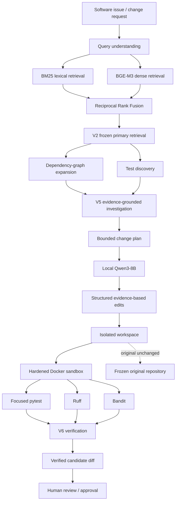
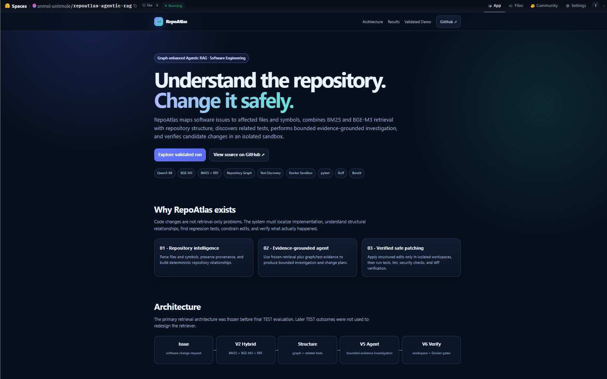
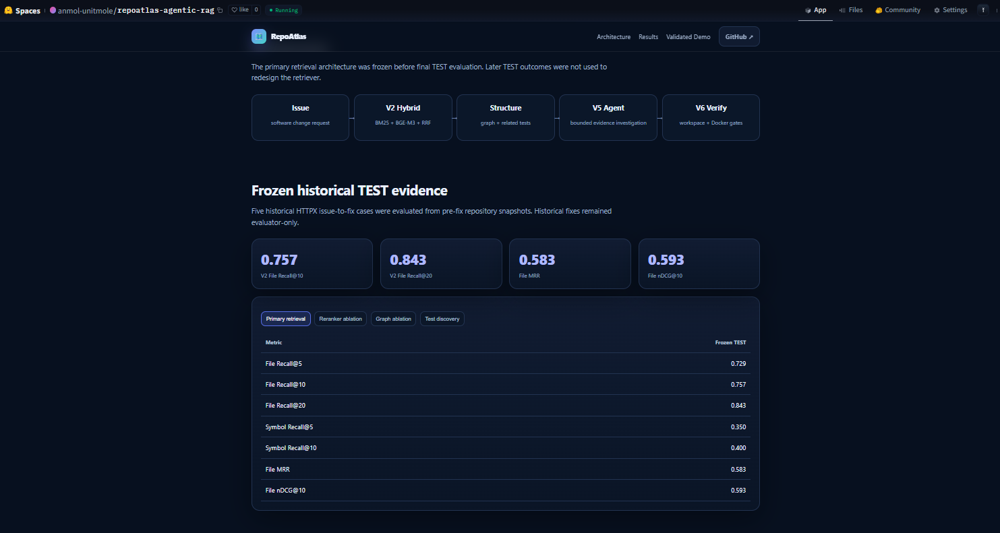
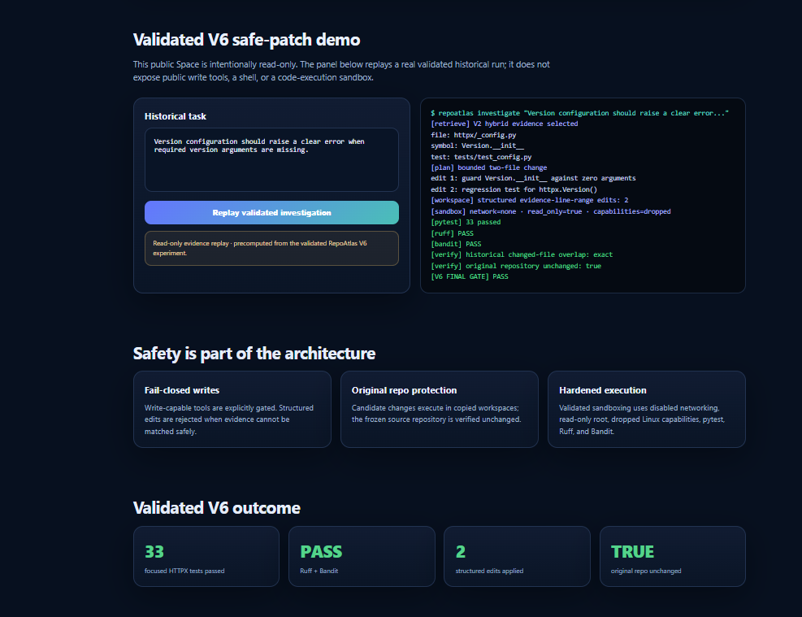

# RepoAtlas — Graph-Enhanced Repository Intelligence & Safe Coding Agent

[](https://www.python.org/)
[](https://huggingface.co/Qwen)
[](https://huggingface.co/BAAI/bge-m3)
[](#agentic-investigation)
[](#dependency-graph)
[](https://fastapi.tiangolo.com/)
[](https://www.gradio.app/)
[](https://www.docker.com/)
[](https://huggingface.co/spaces/anmol-unitmole/repoatlas-agentic-rag)
[](https://github.com/unit-mole/repoatlas-agentic-rag/actions)
[](LICENSE)

A portfolio-grade **Agentic AI / Code RAG system for software engineering** that maps software issues to affected files and symbols, combines lexical and semantic retrieval with repository graphs, discovers related tests, performs bounded evidence-grounded investigation, and verifies candidate code changes inside an isolated sandbox.

**Status:** Portfolio-ready, evaluated, GitHub CI validated, and live portfolio application deployed  
**Live application:** [Open the RepoAtlas Hugging Face Space](https://huggingface.co/spaces/anmol-unitmole/repoatlas-agentic-rag)  
**Repository:** [unit-mole/repoatlas-agentic-rag](https://github.com/unit-mole/repoatlas-agentic-rag)  
**Primary stack:** Python · Qwen3-8B · BGE-M3 · BM25 · Reciprocal Rank Fusion · repository graphs · FastAPI · Gradio · Docker · pytest · Ruff · Bandit · Hugging Face Spaces

> **Default mandatory paid external LLM/API dependency: $0.**  
> The validated reasoning path uses a locally served open-source Qwen3 model. Hardware, electricity, and internet access are not claimed to be free.

---

## Responsible Use

RepoAtlas is intended for technical learning, experimentation, research, and portfolio demonstration.

- Generated investigations and patches can be incomplete or incorrect and must be reviewed before acceptance.
- Historical gold fixes are evaluator-only and are never exposed to the runtime agent.
- Write-capable tools are explicitly gated and disabled by default.
- Candidate edits are applied only inside an isolated workspace.
- The original target repository is preserved unchanged.
- Test execution occurs inside a hardened Docker sandbox.
- RepoAtlas does not autonomously push, merge, or deploy code.
- The public Hugging Face Space is read-only and does not expose public code execution.

---

## Business Problem

Software engineers frequently need to modify repositories they did not originally build.

A request that sounds small—

> “Version configuration should raise a clear error when required version arguments are missing.”

—may require understanding:

- the relevant module and class,
- exact implementation symbols,
- indirectly related code,
- repository dependency relationships,
- regression-test locations,
- historical behavior,
- safe change boundaries,
- and whether a proposed change actually passes verification.

Traditional keyword search is strong for exact identifiers. Dense RAG is strong for semantic similarity. Neither alone reliably captures program structure and change impact.

This project answers:

> **Can an Agentic RAG system identify what is affected, explain why it is affected, determine what should change, and verify a minimal candidate change without compromising the original repository?**

The system returns or derives:

- affected-file evidence,
- affected-symbol evidence,
- repository-relationship context,
- related-test evidence,
- a bounded investigation,
- a minimal change plan,
- structured candidate edits,
- test / lint / security verification,
- and an explicit human-review boundary.

---

## Project Objective

Build a professional repository-intelligence and safe-coding system that can:

1. Parse real Python repositories and retain exact provenance.
2. Extract symbols and syntax-aware chunks.
3. Compare lexical, dense, hybrid, reranked, and graph-enhanced retrieval.
4. Select and freeze the primary retrieval architecture before final TEST evaluation.
5. Build repository dependency relationships.
6. Discover tests associated with likely code changes.
7. Run bounded evidence-grounded agentic investigations.
8. Use local Qwen3 reasoning without mandatory paid external LLM APIs.
9. Generate a minimal change plan only when sufficient evidence exists.
10. Apply candidate edits only inside an isolated workspace.
11. Run focused tests and quality/security checks in Docker.
12. Verify the final diff and preserve the original repository.
13. Export reproducible evaluation evidence and failure analysis.
14. Expose local application interfaces through FastAPI and Gradio.
15. Publish a professional GitHub repository and a read-only Hugging Face Static Space.

---

## Project Pattern

| Item | Implementation |
|---|---|
| Project name | `repoatlas-agentic-rag` |
| Application | Repository intelligence, change-impact analysis, and safe code modification |
| Reasoning model | Qwen3-8B locally |
| Dense embeddings | `BAAI/bge-m3` |
| Sparse retrieval | BM25 |
| Fusion | Reciprocal Rank Fusion |
| Selected retrieval runtime | V2 Hybrid — BM25 + BGE-M3 + RRF |
| Reranker | Selective BGE reranker retained as an ablation |
| Repository structure | Symbol / dependency graph |
| Agent | Evidence-grounded bounded investigation |
| Safe coding | Structured edits in isolated workspaces |
| Test execution | Hardened Docker sandbox |
| Quality gates | pytest · Ruff · Bandit |
| API / UI | FastAPI + Gradio |
| Deployment | GitHub + Hugging Face Static Space |
| Evaluation | Frozen historical HTTPX issue-to-fix benchmark |
| Cost posture | $0 mandatory paid external LLM/API dependency |

---

## Tools and Technologies

| Area | Technology |
|---|---|
| Language | Python 3.12 |
| Local reasoning | Qwen3-8B |
| Dense retrieval | BAAI/bge-m3 |
| Sparse retrieval | BM25 |
| Fusion | Reciprocal Rank Fusion |
| Reranker ablation | BGE selective reranking |
| Repository graph | Python static / syntax relationships |
| Agent orchestration | Bounded evidence-grounded investigation workflow |
| Safe edits | Structured evidence-line-range edits |
| Sandbox | Docker |
| Testing | pytest |
| Code quality | Ruff |
| Security analysis | Bandit |
| API | FastAPI |
| Local UI | Gradio |
| Automation | GitHub Actions |
| Public application | Hugging Face Static Spaces |
| Packaging | Git tags + reproducible ZIP/checksum |
| License | MIT |

---

## What this repository demonstrates

- Syntax-aware repository ingestion
- Python symbol extraction
- Exact file/symbol provenance
- BM25 lexical code retrieval
- BGE-M3 dense code retrieval
- Dense + BM25 hybrid retrieval
- Reciprocal Rank Fusion
- Selective reranking as a measured ablation
- Dependency-graph construction and expansion
- Related-test discovery
- Frozen benchmark methodology with leakage prevention
- Evidence-grounded issue investigation
- Local Qwen3 reasoning
- Safe structured code-edit generation
- Fail-closed patch application
- Isolated workspaces
- Network-disabled Docker execution
- Focused pytest execution
- Ruff and Bandit verification
- Original-repository immutability
- FastAPI
- Gradio
- Reproducible JSON / CSV / Markdown experiment evidence
- GitHub Actions CI
- Hugging Face Static Space deployment

---

## Problem

RepoAtlas is not built around the assumption that repository understanding is just “embed the files and ask an LLM.”

A real repository change may require:

- exact lexical matching,
- semantic retrieval,
- symbol-level localization,
- repository relationships,
- test discovery,
- bounded planning,
- safe workspace isolation,
- controlled editing,
- and verification against executable behavior.

RepoAtlas models that workflow end to end.

---

## Benchmark Data

The primary evaluation uses **five frozen historical HTTPX issue-to-fix cases**.

Each case is evaluated from the repository state immediately before the historical fix:

| Property | Value |
|---|---:|
| Frozen historical TEST cases | **5** |
| Primary repository | **HTTPX** |
| Runtime repository state | **Pre-fix BASE commit** |
| Historical FIX visibility to runtime | **None** |
| Historical FIX use | **Evaluator-only** |
| Primary frozen retriever | **V2 Hybrid** |
| Frozen config checksum protection | **Enabled** |

The benchmark deliberately separates runtime evidence from historical gold fixes to prevent future-fix leakage.

See [BENCHMARK.md](BENCHMARK.md) and [DATA_SOURCES.md](DATA_SOURCES.md).

---

## End-to-End Project Workflow

```text
Software issue / change request
            │
            ▼
      Repository parsing
            │
            ├──────────────► File / symbol provenance
            └──────────────► Dependency relationships
            │
            ▼
    BM25 lexical retrieval
            │
            ├──────────────► BGE-M3 dense retrieval
            │
            ▼
   Reciprocal Rank Fusion
            │
            ▼
      Selected V2 Hybrid
            │
            ├──────────────► Dependency graph
            └──────────────► Test discovery
                               │
                               ▼
                    V5 evidence-grounded investigation
                               │
                               ▼
                         Local Qwen3
                               │
                               ▼
                      Bounded change plan
                               │
                               ▼
                 Structured evidence-based edits
                               │
                               ▼
                       Isolated workspace
                               │
                               ▼
                   Hardened Docker sandbox
                               │
             ┌─────────────────┼─────────────────┐
             ▼                 ▼                 ▼
          pytest              Ruff             Bandit
             └─────────────────┼─────────────────┘
                               ▼
                       V6 verification
                               │
                               ▼
                       Candidate diff
                               │
                               ▼
                         Human review
```

---

## Architecture



### Selected production retrieval strategy

```text
V2 Hybrid = BM25 + BGE-M3 + Reciprocal Rank Fusion
```

The primary retrieval architecture was frozen before final TEST evaluation. Later TEST results were not used to redesign or tune the retrieval system.

---

## Retrieval Architecture

RepoAtlas treats code retrieval as an experimental system rather than assuming that more model layers are automatically better.

```text
Issue
 ├── BM25 lexical retrieval
 └── BGE-M3 dense retrieval
          ↓
 Reciprocal Rank Fusion
          ↓
 V2 Hybrid — frozen primary retrieval
          ↓
 Repository graph / test discovery
          ↓
 Evidence-grounded investigation
```

The selective reranker remains in the repository as a measured ablation rather than the selected primary runtime.

---

## Dependency Graph

RepoAtlas builds deterministic repository relationships around symbols and files so the agent can reason beyond vector similarity.

The graph layer supports:

- imports,
- symbol relationships,
- dependency neighborhoods,
- related files,
- test associations,
- multi-hop evidence expansion.

The protected V4P graph experiment preserved the frozen V2 aggregate retrieval metrics on the five-case TEST set but did **not** produce an aggregate retrieval gain.

The graph is therefore retained as a structural reasoning and impact-analysis layer without claiming an unsupported retrieval improvement.

---

## Experimental evolution

| Version | Purpose | Outcome |
|---|---|---|
| V0 | Lexical / BM25 baseline | Exact-match baseline |
| V1 | Dense BGE-M3 retrieval | Semantic retrieval |
| V2 | BM25 + BGE-M3 + RRF | **Selected and frozen primary retrieval** |
| V3 / V3S | Reranking / selective reranking | Small deeper-rank symbol gain, materially higher latency |
| V4 / V4P | Graph-enhanced retrieval | Structural layer retained; no aggregate TEST gain |
| V5 | Evidence-grounded investigation agent | Validated investigation workflow |
| V6 | Safe patch generation + sandbox verification | **Verified safe-patch workflow** |

### Frozen TEST retrieval result

| Metric | V2 Frozen TEST |
|---|---:|
| File Recall@5 | **0.729** |
| File Recall@10 | **0.757** |
| File Recall@20 | **0.843** |
| Symbol Recall@5 | **0.350** |
| Symbol Recall@10 | **0.400** |
| Symbol Recall@20 | **0.400** |
| File MRR | **0.583** |
| File nDCG@10 | **0.593** |

### Selective reranker ablation — V3S

| Metric | V2 | V3S |
|---|---:|---:|
| File Recall@10 | **0.757** | **0.757** |
| Symbol Recall@5 | **0.350** | 0.272 |
| Symbol Recall@10 | 0.400 | **0.422** |
| Symbol Recall@20 | 0.400 | **0.422** |
| Mean retrieval / E2E latency | **30.9 ms** | **981.7 ms** |

V3S provided a small improvement at deeper symbol ranks but reduced Symbol Recall@5 and materially increased latency. V2 therefore remains the frozen primary retrieval architecture.

### Protected graph ablation — V4P

| Metric | V2 | V4P |
|---|---:|---:|
| File Recall@5 | 0.729 | 0.729 |
| File Recall@10 | 0.757 | 0.757 |
| File Recall@20 | 0.843 | 0.843 |
| Symbol Recall@10 | 0.400 | 0.400 |
| MRR | 0.583 | 0.583 |
| nDCG@10 | 0.593 | 0.593 |

**Conclusion:** protected graph expansion preserved the baseline but did not improve aggregate retrieval on this TEST set.

### Changed-test discovery

| Source | Recall@10 | Recall@20 | MRR |
|---|---:|---:|---:|
| V2 Hybrid | **0.667** | **0.933** | 0.360 |
| V3 Rerank | 0.467 | 0.700 | **0.450** |

V2 retained materially stronger changed-test recall.

---

## Agentic Investigation

V5 converts retrieval evidence into a bounded repository investigation.

For the validated HTTPX configuration task, the agent correctly localized:

- `httpx/_config.py`
- `Version.__init__`
- `tests/test_config.py`
- the relevant version-regression test area

The LLM explains and synthesizes repository evidence, while retrieval choice, graph expansion, stopping conditions, tool boundaries, and write permissions remain code-controlled.

---

## V6 Safe Coding Workflow

V6 extends investigation into controlled code modification:

```text
Issue
  ↓
Frozen V2 retrieval
  ↓
V5 evidence
  ↓
Deterministic patch plan
  ↓
Local Qwen3 patch generation
  ↓
Structured evidence-based edits
  ↓
Isolated workspace
  ↓
Hardened Docker sandbox
  ↓
Focused tests + Ruff + Bandit
  ↓
Diff verification
  ↓
Human review
```

### Verified V6 historical task

Task:

> Version configuration should raise a clear error when required version arguments are missing.

RepoAtlas generated a bounded two-file modification affecting exactly:

```text
httpx/_config.py
tests/test_config.py
```

| Check | Result |
|---|---|
| Structured edits applied | **2** |
| Historical changed-file overlap | **Exact** |
| Focused HTTPX tests | **33 passed** |
| Ruff verification | **PASS** |
| Bandit verification | **PASS** |
| Docker network | **Disabled** |
| Read-only sandbox root | **Enabled** |
| Linux capabilities | **Dropped** |
| Original frozen repository | **Unchanged** |
| Final V6 gate | **PASS** |

The validated guard was introduced in `Version.__init__`, together with a regression test for constructing `httpx.Version()` without required arguments.

---

## Evaluation

RepoAtlas evaluates more than answer quality.

The framework measures or records:

- affected-file recall,
- affected-symbol recall,
- Mean Reciprocal Rank,
- nDCG,
- changed-test recall,
- reranker latency,
- graph-ablation behavior,
- affected-file / symbol localization,
- patch application outcome,
- focused-test results,
- static-analysis results,
- security verification,
- changed-file overlap,
- and original-repository preservation.

Final TEST results are frozen and are not used for post-hoc architecture tuning.

---

## Open-source model stack

| Role | Default |
|---|---|
| Reasoning LLM | Qwen3-8B locally |
| LLM interface | Local OpenAI-compatible endpoint |
| Dense embeddings | `BAAI/bge-m3` |
| Sparse retrieval | BM25 |
| Fusion | Reciprocal Rank Fusion |
| Reranker | Selective BGE reranker as an ablation |
| Repository intelligence | Static / syntax dependency graph |
| Sandbox | Docker |
| API | FastAPI |
| UI | Gradio |

The public Hugging Face Static Space does not run the full local Qwen3 / Docker workflow server-side.

---

## Validated application behavior

Final local validation confirmed:

- `ruff check` passing,
- RepoAtlas pytest suite passing with **35 tests**,
- frozen retrieval checksum verification,
- FastAPI API test passing,
- Python application compilation passing,
- tracked-secret scan passing,
- tracked-large-file scan passing,
- V6 focused HTTPX regression suite passing with **33 tests**,
- V6 Ruff and Bandit verification passing,
- original frozen repository remaining unchanged,
- GitHub Actions CI passing,
- and the Hugging Face Static Space deploying successfully.

---

## Local Application Interfaces

### FastAPI

The API implementation lives under:

```text
src/repoatlas/api/
```

See [RUNBOOK.md](RUNBOOK.md) for the validated local execution path.

The repository includes API tests under:

```text
tests/test_api.py
```

### Gradio

The local UI entry point is:

```text
app/gradio_app.py
```

Run:

```bash
python app/gradio_app.py
```

The public hosted portfolio demo remains intentionally read-only.

---

## Hugging Face Static Space

The public application is available at:

[](https://huggingface.co/spaces/anmol-unitmole/repoatlas-agentic-rag)

| Component | Validated local project | Public Static Space |
|---|---|---|
| Qwen3 reasoning | Live local inference | Precomputed validated output |
| BGE-M3 retrieval | Live local pipeline | Saved validated results |
| BM25 / RRF | Live local pipeline | Saved validated results |
| Repository graph | Live local pipeline | Architecture / evidence presentation |
| V5 investigation | Live local workflow | Validated workflow replay |
| V6 safe patch | Isolated local workspace + Docker | Read-only validated replay |
| FastAPI / Gradio | Local interfaces | Not executed server-side |
| Docker sandbox | Hardened local execution | Not exposed publicly |
| Purpose | Engineering implementation and evaluation | Public portfolio showcase |

The Static Space does **not** claim to perform live Qwen3 inference, arbitrary repository modification, or public Docker execution. This separation keeps the public demonstration technically honest while GitHub preserves the full implementation and experiment evidence.

---

## Live Application

[](https://huggingface.co/spaces/anmol-unitmole/repoatlas-agentic-rag)

The Hugging Face deployment is a **static interactive portfolio demonstration** that presents genuine precomputed outputs and measurements from the validated local RepoAtlas workflow.

### Application Overview



*RepoAtlas live portfolio interface showing the repository-intelligence positioning, engineering stack, public deployment link, and core system capabilities.*

### Frozen Historical TEST Evaluation



*Frozen historical HTTPX evaluation showing the selected V2 hybrid retrieval metrics and measured retrieval / ablation evidence.*

### Verified V6 Safe-Patch Workflow



*Validated V6 replay showing evidence-grounded localization, bounded structured edits, hardened sandbox verification, focused tests, Ruff/Bandit gates, and original-repository preservation.*

---

## Security posture

Repository content and generated modifications are treated as potentially unsafe inputs to a coding-agent workflow.

RepoAtlas applies:

- explicit write-tool gating,
- isolated copied workspaces,
- no autonomous modification of the frozen original repository,
- fail-closed structured edit application,
- network-disabled Docker execution,
- read-only sandbox root,
- dropped Linux capabilities,
- focused pytest verification,
- Ruff verification,
- Bandit verification,
- and final diff / immutability checks.

See [SECURITY.md](SECURITY.md) and [docs/THREAT_MODEL.md](docs/THREAT_MODEL.md).

---

## Human-in-the-loop

RepoAtlas may investigate, plan, and produce a verified **candidate** modification.

The final boundary remains:

```text
Agent investigation
        ↓
Candidate structured edits
        ↓
Automated verification
        ↓
Human review / approval
```

RepoAtlas does not autonomously merge, push, or deploy the generated candidate patch.

---

## Benchmark Methodology and Leakage Prevention

Historical issue-to-fix evaluation follows:

```text
Historical issue / task
        ↓
BASE commit before the fix
        ↓
Frozen repository snapshot
        ↓
No future commits or patches visible to runtime
        ↓
RepoAtlas execution
        ↓
Historical FIX used only by evaluator
```

The frozen retrieval configuration is checksum-protected:

```text
configs/retrieval_frozen_v1.json
SHA256:
57e20457c7728d3886f6914f63d4f4aef711cd85b262e24606ca09199a2a14b6
```

This separation prevents benchmark fixes from leaking into retrieval, planning, or patch generation.

---

## Failure analysis

Development failures are retained as engineering evidence instead of being hidden.

Important failure modes included:

1. **Free-form unified diff corruption**  
   Replaced by structured evidence-based edits.

2. **Brittle exact-text replacement**  
   Improved through evidence-line-range editing and fail-closed matching.

3. **Historical test dependency mismatch**  
   The candidate patch was correct, but the sandbox initially lacked historical HTTPX test dependencies. Controlled dependency provisioning allowed the same patch to pass **33 focused tests**.

4. **Reranker latency trade-off**  
   Selective reranking improved deeper symbol recall slightly but materially increased latency and worsened early-rank symbol recall.

5. **Graph ablation neutrality**  
   Graph expansion did not improve aggregate frozen-TEST retrieval, so RepoAtlas does not claim that it did.

---

## Generated outputs

Important final evidence artifacts include:

```text
reports/experiments/httpx-test-preparation.json
reports/experiments/httpx-test-test-discovery.json
reports/experiments/httpx-test-v3s-selective-reranker.json
reports/experiments/httpx-test-v4p-protected-graph.json
reports/experiments/safe_patch_fixture.json
reports/experiments/v5-httpx-test-005.json
reports/experiments/v6-httpx-test-005.json

reports/final/FINAL_RESULTS.md
reports/final/final_metrics_inventory.csv
reports/final/final_results_manifest.json
```

The final manifest stores SHA-256 hashes of the experiment evidence used by the public project.

---

## Repository structure

```text
repoatlas-agentic-rag/
├── .github/
│   └── workflows/
├── app/
│   └── gradio_app.py
├── assets/
│   └── screenshots/
├── benchmark/
│   ├── builders/
│   ├── cases/
│   ├── gold/
│   └── runners/
├── configs/
├── docs/
│   ├── ARCHITECTURE.md
│   ├── PORTFOLIO_NOTES.md
│   ├── RESEARCH_VERIFICATION.md
│   └── THREAT_MODEL.md
├── reports/
│   ├── experiments/
│   └── final/
├── sandbox/
├── scripts/
├── src/
│   └── repoatlas/
│       ├── agents/
│       ├── api/
│       ├── embeddings/
│       ├── evaluation/
│       ├── git/
│       ├── graph/
│       ├── llm/
│       ├── parsing/
│       ├── patching/
│       ├── retrieval/
│       ├── sandbox/
│       ├── security/
│       └── tools/
├── tests/
├── .env.example
├── BENCHMARK.md
├── DATA_SOURCES.md
├── RUNBOOK.md
├── SECURITY.md
├── VALIDATION.md
├── LICENSE
└── README.md
```

Generated repository snapshots, model caches, local workspaces, failed intermediate runs, and machine-specific runtime artifacts are intentionally excluded from the public repository.

---

## Quick start - WSL / Linux

Read [RUNBOOK.md](RUNBOOK.md) for the complete validated run instructions.

### 1. Clone

```bash
git clone https://github.com/unit-mole/repoatlas-agentic-rag.git
cd repoatlas-agentic-rag
```

### 2. Create the environment

```bash
python3 -m venv .venv
source .venv/bin/activate
python -m pip install --upgrade pip
```

### 3. Install the project

Use `pyproject.toml` and [RUNBOOK.md](RUNBOOK.md) for the complete dependency setup.

### 4. Run deterministic quality checks

```bash
python -m ruff check src tests scripts benchmark
python -m pytest -q
sha256sum -c reports/experiments/retrieval_frozen_v1.sha256
```

Validated baseline:

```text
All checks passed!
35 passed
configs/retrieval_frozen_v1.json: OK
```

### 5. Run the local Gradio interface

```bash
python app/gradio_app.py
```

---

## Reproduce the frozen evaluation

The repository contains dedicated frozen TEST evaluators for:

```text
protected graph expansion
selective reranking
changed-test discovery
V5 investigation
V6 safe patch verification
```

See:

- [RUNBOOK.md](RUNBOOK.md)
- [BENCHMARK.md](BENCHMARK.md)
- [reports/final/FINAL_RESULTS.md](reports/final/FINAL_RESULTS.md)

Do not tune the system using frozen-TEST results.

---

## CI

GitHub Actions is configured under:

```text
.github/workflows/ci.yml
```

The public CI run validates deterministic repository checks without requiring the large local Qwen / historical Docker execution path.

---

## Documentation Map

| Document | Purpose |
|---|---|
| [BENCHMARK.md](BENCHMARK.md) | Frozen benchmark design and evaluation policy |
| [DATA_SOURCES.md](DATA_SOURCES.md) | Repository/data provenance |
| [SECURITY.md](SECURITY.md) | Security policy |
| [VALIDATION.md](VALIDATION.md) | Validation scope and evidence |
| [RUNBOOK.md](RUNBOOK.md) | Local execution instructions |
| [docs/ARCHITECTURE.md](docs/ARCHITECTURE.md) | Architecture details |
| [docs/THREAT_MODEL.md](docs/THREAT_MODEL.md) | Threat model |
| [docs/RESEARCH_VERIFICATION.md](docs/RESEARCH_VERIFICATION.md) | Research / technical verification notes |
| [reports/final/FINAL_RESULTS.md](reports/final/FINAL_RESULTS.md) | Final evidence index |

---

## Limitations

- The primary benchmark currently uses five frozen historical HTTPX cases.
- Python is the primary supported language.
- Graph expansion did not improve aggregate retrieval on the frozen TEST set.
- Symbol recall remains substantially harder than file localization.
- Selective reranking is too expensive to replace V2 as the default primary retrieval stage.
- V6 historical safe-patching has been deeply verified on the validated HTTPX configuration task; broader autonomous patch success must be measured before making stronger claims.
- The public Hugging Face Static Space replays validated precomputed evidence rather than executing the full Qwen3 / Docker coding-agent stack live.
- RepoAtlas is portfolio/research engineering, not a claim of autonomous production software maintenance.

---

## Future work

Potential extensions include:

- larger frozen historical safe-patching benchmarks,
- JavaScript / TypeScript repository support,
- richer static-analysis relationships,
- incremental indexing after commits,
- editor/client MCP integrations,
- PR review mode,
- patch ranking,
- broader repository benchmarks,
- richer graph visualization,
- authenticated private-repository support,
- and hosted live inference when a suitable secure execution environment is available.

---

## Skills Demonstrated

- Generative AI
- Retrieval-Augmented Generation
- Agentic AI
- Code RAG
- Hybrid retrieval
- Dense embeddings
- BGE-M3
- BM25
- Reciprocal Rank Fusion
- Repository intelligence
- Static code analysis
- Dependency graphs
- Graph-enhanced retrieval
- Symbol localization
- Test discovery
- Qwen3 local inference
- Evidence-grounded generation
- Bounded tool use
- Agent planning and stopping logic
- Safe structured editing
- Sandbox isolation
- Docker security
- Failure analysis
- Retrieval evaluation
- Frozen-test methodology
- Latency benchmarking
- FastAPI
- Gradio
- pytest
- Ruff
- Bandit
- GitHub Actions
- Hugging Face Static Spaces
- Portfolio-focused AI engineering

---

## Result policy

Performance claims in this README are taken only from locally generated evaluation artifacts.

The frozen historical TEST benchmark is not used for subsequent retrieval-architecture tuning.

The public Static Space is explicitly disclosed as a precomputed read-only demonstration and does not claim to reproduce the full local Qwen3 / Docker runtime.

---

## Portfolio Positioning

**One-line description:** Graph-enhanced Agentic RAG system for repository intelligence, change-impact analysis, test discovery, evidence-grounded investigation, and verified safe code modification.

**Pinned repository description:** Portfolio-grade Agentic Code RAG project with BGE-M3 + BM25/RRF hybrid retrieval, repository dependency graphs, Qwen3-based investigation, test discovery, hardened Docker verification, frozen historical HTTPX evaluation, GitHub CI, and a live Hugging Face portfolio demo.

---

## Engineering Takeaway

RepoAtlas is not:

> “Send an entire repository to an LLM and ask it to fix a bug.”

It is:

```text
Repository Parsing
+ Symbol Indexing
+ Lexical Retrieval
+ Dense Retrieval
+ Hybrid Fusion
+ Dependency Graphs
+ Test Discovery
+ Evidence-Grounded Agentic Investigation
+ Structured Safe Editing
+ Hardened Sandboxing
+ Automated Verification
+ Frozen Benchmark Evaluation
```

The central engineering question is not merely whether a model can generate code.

It is whether a software-engineering agent can **retrieve the right evidence, reason within explicit boundaries, make a minimal candidate change, and prove what happened without compromising the original repository.**

---

## License

Project code: MIT.

Historical open-source repositories, model weights, and third-party dependencies retain their own licenses. See [DATA_SOURCES.md](DATA_SOURCES.md).

---

## Author

**Anmol Tripathi**

Quality Data Scientist building portfolio projects in Data Science, Machine Learning, Applied AI, Generative AI, Agentic RAG, Natural Language Processing, Analytics Engineering, and Quality Analytics.
